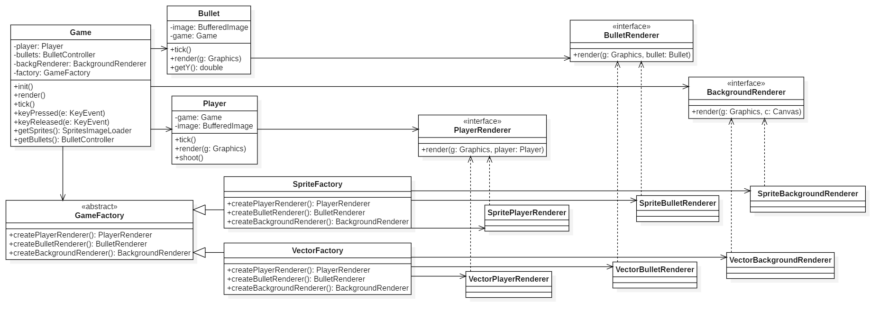

# Space War 2D

## Cambios Realizados

### Implementación de Gráficos Vectoriales

Hemos añadido soporte para gráficos vectoriales además de gráficos basados en sprites. Ahora es posible cambiar el estilo visual del juego fácilmente.

### Interfaz de Renderizado

- **IBackgroundRenderer**: Maneja el renderizado de fondos.
- **IPlayerRenderer**: Se encarga del renderizado del jugador.
- **IBulletRenderer**: Define cómo se renderizan las balas.

### Inversión de Dependencias

Se ha aplicado el principio de Inversión de Dependencias (DIP) para desacoplar las dependencias en el juego. En lugar de que las clases de alto nivel (como `Game`) dependan de implementaciones concretas de renderizadores, ahora dependen de interfaces (`IBackgroundRenderer`, `IPlayerRenderer`, `IBulletRenderer`). Esto permite cambiar las implementaciones de renderizado sin modificar las clases que las usan.

### Fábrica Abstracta

Se utiliza el patrón de Fábrica Abstracta para crear instancias de los renderizadores de manera flexible. Este patrón permite crear familias de objetos relacionados (como `VectorBackgroundRenderer` y `SpriteBackgroundRenderer`) sin especificar sus clases concretas. La clase `RendererFactory` proporciona métodos para obtener instancias de los renderizadores adecuados según la configuración actual, permitiendo cambiar el estilo visual del juego simplemente cambiando la configuración de la fábrica.

### Cómo Cambiar el Tipo de Gráficos

Para cambiar el tipo de gráficos en el juego, simplemente modifica la configuración de la fábrica de renderizado en el método `init` de la clase `Game`. Puedes elegir entre el renderizado basado en sprites o en vectores mediante la siguiente configuración:

```java
public void init() {
    requestFocus();
    // Configura la fábrica de renderizado aquí
    // Puedes cambiar entre SpriteRendererFactory y VectorRendererFactory
    //rendererFactory = new SpriteRendererFactory(this); // Para sprites
    rendererFactory = new VectorRendererFactory(); // Para vectores
}
```

## Imagen UML

A continuación se muestra el diagrama UML que representa la estructura del juego:



Para ver y editar el modelo UML, utiliza el archivo [GameUML.mdj](GameUML.mdj) en StarUML.

## Detalles Importantes

- **ConcurrentModificationException**: Se resolvió un problema de modificación concurrente en la clase `BulletController` mediante el uso de un `Iterator` para eliminar elementos de la lista de balas.

- **Cambio de Tipo de Renderer**: Asegúrate de actualizar las referencias a los renderizadores en la clase `Game` para evitar incompatibilidades.

¡Gracias por contribuir y disfruta del juego!
