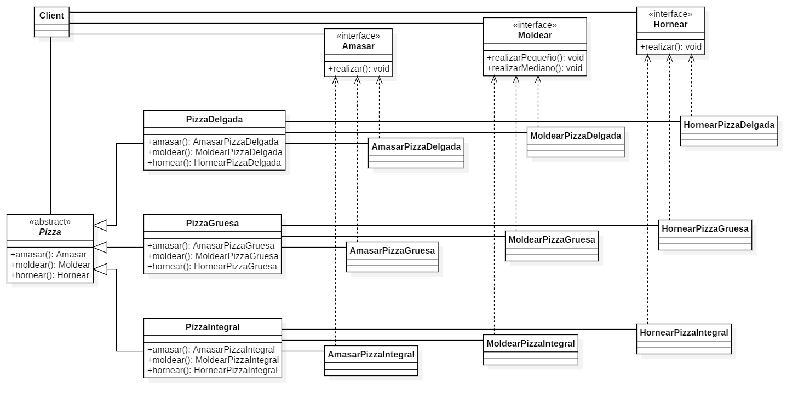

# Pizza Factory

## Descripción del Proyecto

Este proyecto implementa el patrón de diseño Fábrica Abstracta para una aplicación de preparación de pizzas. El objetivo es demostrar cómo crear un sistema flexible para la preparación de diferentes tipos de pizzas utilizando fábricas abstractas.

## Estructura del Proyecto

### 1. **Interfaces**

- **Amasar.java**: Define el método `amasar` para amasar la pizza.
- **Moldear.java**: Define los métodos `moldearPizzaPequena` y `moldearPizzaMediana` para moldear la pizza en tamaños pequeños y medianos.
- **Hornear.java**: Define el método `hornear` para hornear la pizza.

### 2. **Implementaciones para Tipos de Masa**

- **AmasadorPizzaDelgada.java**, **MoldeadorPizzaDelgada.java**, **HorneadorPizzaDelgada.java**: Implementan las interfaces para pizzas de masa delgada.
- **AmasadorPizzaGruesa.java**, **MoldeadorPizzaGruesa.java**, **HorneadorPizzaGruesa.java**: Implementan las interfaces para pizzas de masa gruesa.
- **AmasadorPizzaIntegral.java**, **MoldeadorPizzaIntegral.java**, **HorneadorPizzaIntegral.java**: Implementan las interfaces para pizzas de masa integral.

### 3. **Fábricas**

- **PizzaDelgadaFactory.java**: Fábrica para pizzas de masa delgada.
- **PizzaGruesaFactory.java**: Fábrica para pizzas de masa gruesa.
- **PizzaIntegralFactory.java**: Fábrica para pizzas de masa integral.

### 4. **PreparadorPizza.java**

La clase **PreparadorPizza** utiliza las fábricas para crear y preparar pizzas según el tipo de masa y tamaño especificado. Esta clase incluye la lógica para aplicar ingredientes y manejar el proceso de preparación de la pizza.

## Cambios Realizados

1. **Adición de Tipos de Masa**: Se añadieron las implementaciones para pizzas con masa gruesa e integral, además de la masa delgada.
2. **Fábricas para Cada Tipo de Pizza**: Se crearon fábricas específicas para cada tipo de masa que implementan las interfaces de amasar, moldear y hornear.
3. **Actualización de PreparadorPizza**: La clase **PreparadorPizza** fue actualizada para usar las diferentes fábricas y manejar la preparación de pizzas con distintos tipos de masa.

## Diagrama UML

El diagrama UML que representa el diseño del sistema se encuentra en el archivo `PizzaUML.png`.

Para visualizar el modelo en StarUML, utilice el archivo `PizzaUML.mdj`.

## Instrucciones de Ejecución

1. Compile el proyecto utilizando un entorno de desarrollo compatible con Java.
2. Ejecute la clase **PreparadorPizza** para ver la preparación de la pizza en la consola.
3. Asegúrese de tener los archivos `PizzaUML.png` y `PizzaUML.mdj` en el mismo directorio para una correcta visualización y documentación.

## Notas

- **Excepciones**: La clase `ExcepcionParametrosInvalidos` maneja errores relacionados con parámetros inválidos en la preparación de la pizza.
- **Microcontrolador**: Los comentarios de código indican lugares donde se podría integrar un microcontrolador para la implementación real.