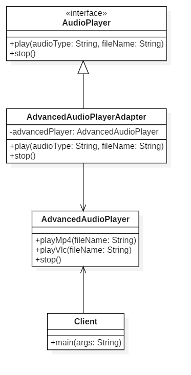

# Music Player Adapter Project

## Descripción del Proyecto

Este proyecto implementa un patrón adaptador para permitir que un reproductor de audio básico (`AudioPlayer`) utilice las funcionalidades avanzadas de un reproductor de audio más sofisticado (`AdvancedAudioPlayer`) sin modificar el código existente del reproductor básico.

### Estructura del Proyecto

1. **AudioPlayer**: 
   - **Interfaz** que define los métodos básicos `play` y `stop` para los reproductores de audio.

2. **AdvancedAudioPlayer**: 
   - **Clase** que proporciona funcionalidades avanzadas para reproducir archivos de audio en formatos MP4 y VLC.

3. **AdvancedAudioPlayerAdapter**: 
   - **Adaptador** que implementa la interfaz `AudioPlayer` y utiliza una instancia de `AdvancedAudioPlayer` para delegar las llamadas a los métodos específicos.

4. **Client**: 
   - **Clase de prueba** que demuestra el uso de `AudioPlayer` a través del adaptador `AdvancedAudioPlayerAdapter`.

### Diagrama UML

El diagrama UML que representa la estructura del proyecto se encuentra a continuación:

### Archivos Relacionados

- **MusicPlayerUML.mdj**: Contiene el modelo UML implementado en StarUML.
- **MusicPlayerUML.png**: Diagrama del modelo UML.

Ambos archivos se encuentran en la misma ruta que este archivo `README.md`.
