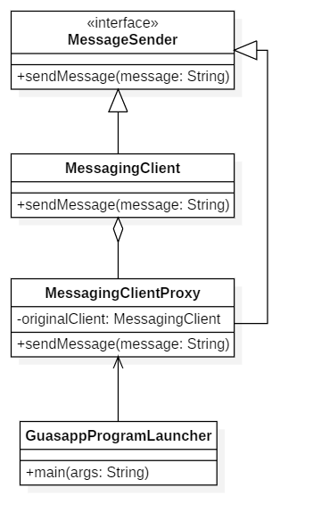

# Secure Messaging App

## Descripción del Proyecto

Este proyecto implementa un patrón Proxy para mejorar la seguridad de una herramienta de mensajería al bloquear mensajes con contenido peligroso. El patrón Proxy se utiliza para controlar el acceso al cliente de mensajería real y evitar que se procesen mensajes maliciosos.

### Estructura del Proyecto

1. **MessageSender**:
   - **Interfaz** que define el método `sendMessage` para enviar mensajes.

2. **MessagingClient**:
   - **Implementa** la interfaz `MessageSender` y proporciona la funcionalidad real para enviar mensajes.

3. **MessagingClientProxy**:
   - **Implementa** la interfaz `MessageSender`.
   - Actúa como un intermediario que controla el acceso al `MessagingClient` y bloquea mensajes con contenido peligroso.

4. **GuasappProgramLauncher**:
   - **Clase de prueba** que utiliza `MessagingClientProxy` para enviar mensajes y asegura que los mensajes peligrosos sean bloqueados.

### Diagrama UML

El diagrama UML que representa la estructura del proyecto se encuentra a continuación:

### Archivos Relacionados

- **SecureMessagingApp.mdj**: Contiene el modelo UML implementado en StarUML.
- **SecureMessagingApp.png**: Diagrama del modelo UML.

Ambos archivos se encuentran en la misma ruta que este archivo `README.md`.